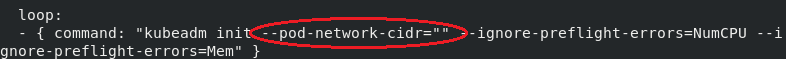

# Kubernetes multinode cluster over AWS


Link to article -> [Article](https://www.linkedin.com/posts/yash-indane-aa6534179_vimaldaga-righteducation-educationredefine-activity-6763765795467104257-_Su7)

## Ansible Roles 
Total 3 roles have been used to achieve this, `k8s_master_conf`, `k8s_worker_conf` & `launch_instances`.

## Prerequisites

#### Make the private key (.pem), protected by -
```
$ sudo chmod 400 <PRIVATE-KEY.pem>
```

#### Copy the ansible.cfg in this repository to /etc/ansible, and configure it accordingly.
```
$ sudo mkdir /etc/ansible && sudo cp ansible.cfg /etc/ansible
```

#### Launch the EC2 nodes -
```
$ ansible-playbook setup.yml
```

### Launching the EC2-instances

Description for role variables used in `launch_instances` role ->

| `Variable` | `description` |
| -------- | ----------- |
| reg      | region      |
| img_id   | AMI id    |
| i_type   | EC2 instance type |
| vpcsi    | vpc-subnet id |
| key      | private key name for instance EC2 |
| sg_group | security group name   |
| kube_master_name | name of EC2 instance for master node |
| aws_ak   | AWS access key |
| aws_sk   | AWS secret key |
| vol_size | volume size for EC2 instance (in Gib) |
| kube_worker_name1 | name of EC2 instance for worker node-1 |
| kube_worker_name2 | name of EC2 instance for worker node-2 |

Write correct device name according to image used in launch_instances role. 

#### (Note- by default it is configured to use device name as `/dev/xvda`)


Have minimum `8 Gib` of volume for each node.

inside k8s_master_config role mention your `pod network CIDR`.

#### (Note- by default it is configured to use `flannel` and pod network cidr as `10.244.0.0/16`)



## Configuring Kubernetes Cluster on launched EC2 nodes

#### Configuring master node -
```
$ ansible-playbook setup-master.yml
```

#### Configuring worker nodes -
```
$ ansible-playbook setup-worker.yml
```

#### Joining worker nodes to master

Login to master node and get the join command -

```
$ sudo kubeadm token create --print-join-command
```

Now login to the worker nodes and execute the joining command on each of them.
