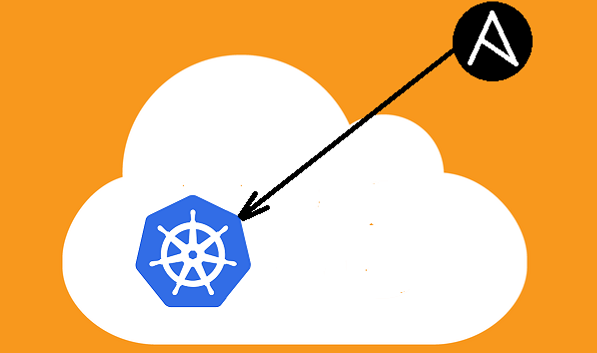
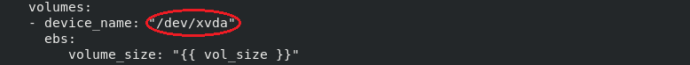

# Kubernetes multinode cluster over AWS




## Ansible Roles 
Total 3 roles have been used to achieve this

### Launching the ec2-instances

Description for role variables used in launch_instances role ->

| Variable | description |
| -------- | ----------- |
| reg      | region      |
| img_id   | image id    |
| i_type   | instance type |
| vpcsi    | vpc-subnet id |
| key      | key name for instance |
| sg_group | security group name   |
| kube_master_name | name of ec2 instance for master |
| aws_ak   | AWS access key |
| aws_sk   | AWS secret key |
| vol_size | volume size for instance (in Gib) |
| kube_worker_name1 | name of ec2 instance for worker 1 |
| kube_worker_name2 | name of ec2 instance for worker 2 |

Write correct device name according to image used 



Have minimum 8 Gib of volume for each node

### Configuring setup.yml file

create a file named `setup.yml` in your machine, write inside this (before running every role) ->

```
- hosts: <host-name>
  roles:
  - role: <path-to-your-role-folder>
```

Now set the roles path

```
ansible-playbook <setup.yml file-location> --roles-path <path-to-your-role-folder>
```

### Configuring ansible.conf file

navigate to `/etc/ansible/ansible.cfg` and write this

```
[defaults]
host_key_checking = False
roles = <path-to-your-role-folder>
inventory = /inven.txt
ask_pass = False
remote_user = ec2-user
private_key_file = <location-of-your-PEM-key>
[privilege_escalation]
become = True
become_method = sudo
become_ask_pass = False
```

### Run the roles by

```
ansible-playbook <path-of-your-setup.yml>
```

### Generate the token by

```
kubeadm token create --print-join-command
```


